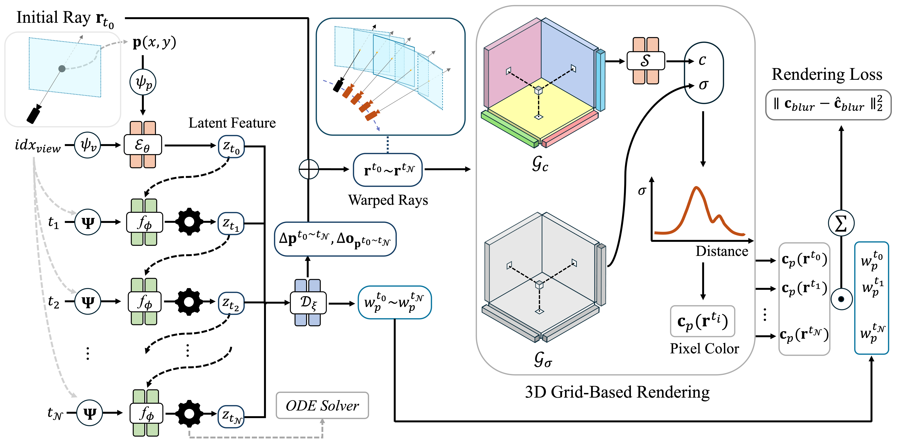

# SMURF: Continuous Dynamics for Motion-Deblurring Radiance Fields
Official Implementation of [SMURF: Continuous Dynamics for Motion-Deblurring Radiance Fields](https://arxiv.org/abs/2403.07547)
- [Project page]() still in the works.

# Method Overview


# Environment Setup
```
# 1. Create conda environment
conda create -n smurf python=3.8

# 2. Activate environment
conda activate smurf

# 3. Clone the repository
git clone https://github.com/Jho-Yonsei/SMURF.git
cd SMURF

# 4. Install packages
pip3 install torch==1.13.1+cu116 torchvision==0.14.1+cu116 torchaudio==0.13.1 --extra-index-url https://download.pytorch.org/whl/cu116
pip3 install -r requirements.txt

# 5. Check where your environment path is ($ conda env list), and copy the files in "for_chrono_view_embedding" directory to "torchdiffeq" package
cp ./for_chrono_view_embedding/* {environment_path}/lib/python3.8/site-packages/torchdiffeq/_impl/
```

# Data Preparation
Dataset is from [Deblur-NeRF](https://github.com/limacv/Deblur-NeRF) and you can download the dataset from [HERE](https://drive.google.com/drive/folders/1_TkpcJnw504ZOWmgVTD7vWqPdzbk9Wx_).
Download ```synthetic_camera_motion_blur``` and ```real_camera_motion_blur``` directories from the drive, and put them into the following sturcture:

```
- SMURF/
    - data/
        - synthetic_camera_motion_blur/
            - blurcozy2room/
            - blurfactory/
            ...
        - real_camera_motion_blur/
            - blurball/
            - blurbasket/
            ...
```

# How to Train
We provide the config files of all scenes in synthetic (5) and real-world (10) scene dataset.

So, if you want to train ```factory``` scene from synthetic dataset on GPU 0:
```
python3 train.py --config ./configs/camera_motion_blur_synthetic/factory.txt --device 0
```
If you want to train ```girl``` scene from real-world dataset on GPU 1:
```
python3 train.py --config ./configs/camera_motion_blur_real/girl.txt --device 1
```

# How to Evaluate

# Pretrained Weights
To be released.

# Citation
Please cite this work if you find it useful:
```
@article{lee2024smurf,
  title={SMURF: Continuous Dynamics for Motion-Deblurring Radiance Fields},
  author={Lee, Jungho and Lee, Dogyoon and Lee, Minhyeok and Kim, Donghyung and Lee, Sangyoun},
  journal={arXiv preprint arXiv:2403.07547},
  year={2024}
}
```


## Acknowledgements

## **TODO**

- [x] Release source code.
- [ ] Update README file.
- [ ] Upload pretrained weights.
